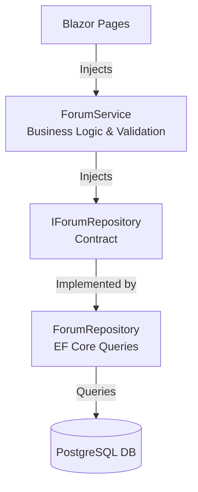
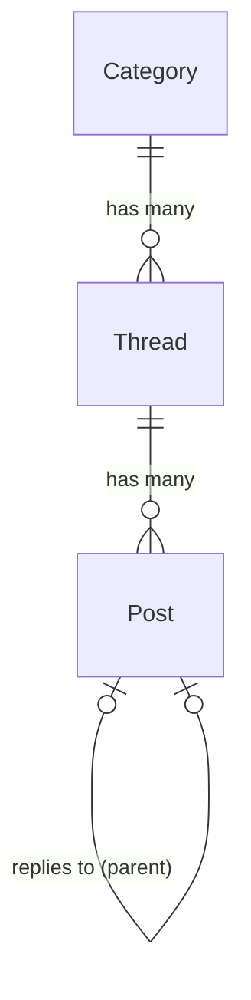

# 🏗️ NetForum - System Architecture

This document describes the architectural foundations, database models, and styling guidelines of the NetForum platform.

---

## ⚡ Interactivity & Rendering Model

NetForum is built as a **Unified Blazor Web App** using **Interactive Server** render mode (`@rendermode InteractiveServer`) applied globally at the root route assembly.

### Key Benefits
* **Pristine Performance:** Real-time bi-directional WebSockets (via ASP.NET Core SignalR) manage UI events instantly without full-page reloads.
* **Unified Assembly Structure:** All components are kept in `NetForum/Components/`. There is no separation into distinct Client assembly DLLs, maximizing developer ergonomics and code reuse.
* **Direct Database Injection:** Blazor components securely inject `IForumService` directly on the server side. No intermediate REST web controllers, JSON serializers, or HTTP clients are required for data fetching.

---

## 🧩 Data Access Architecture (Repository Pattern)

To achieve strict **Separation of Concerns (SoC)** and make the codebase highly maintainable, testable, and robust, NetForum decouples business logic from persistence operations using the **Repository Pattern**:

### Layer Responsibilities

1. **Service Layer (`IForumService` & `ForumService`):**
   * Orchestrates multi-entity business logic transactions.
   * Performs data validation and string sanitization (e.g. trimming titles, falling back to default poster names).
   * Free of database mechanics: does not reference DbContexts or EF Core APIs directly.
2. **Persistence Layer (`IForumRepository` & `ForumRepository`):**
   * Encapsulates Entity Framework Core queries and mutations.
   * Handles asynchronous database context creation (`await using var context = await contextFactory.CreateDbContextAsync();`) to ensure thread safety under concurrent Blazor Server socket connections.
   * Exposes plain C# domain entities to the service layer.

---

## 🗄️ PostgreSQL Database Entity Schema

The database consists of three relational entities configured under Entity Framework Core with automatic cascading deletes and unique keys.

### 1. `Category`
Represents the top-level discussion boards.
* **`Id`** (`int`, PK): Auto-incrementing identifier.
* **`Name`** (`string`): Human-readable name.
* **`Description`** (`string`): Subtitle text describing focus.
* **`Slug`** (`string`, Unique Index): Lowercase URL identifier.
* **`Icon`** (`string`): Bootstrap Icons identifier (e.g. `bi-code-slash`).
* **`DisplayOrder`** (`int`): Positional sorting order on sidebar menus.

### 2. `Thread`
Represents user-created discussions.
* **`Id`** (`Guid`, PK): Unique thread identifier.
* **`CategoryId`** (`int`, FK): Target board (Cascade Deletes enabled).
* **`Title`** (`string`): Subject headline.
* **`Content`** (`string`): Raw body text.
* **`AuthorName`** (`string`): Poster's name (defaults to `"Anonymous"`).
* **`CreatedAt`** (`DateTimeOffset`): Exact post time.
* **`Views`** (`int`): Count of unique clicks.
* **`Upvotes`** (`int`): Heart count (starts with `1` initial self-vote).

### 3. `Post`
Represents comments or replies within a thread.
* **`Id`** (`Guid`, PK): Unique reply identifier.
* **`ThreadId`** (`Guid`, FK): Direct thread connection (Cascade Deletes enabled).
* **`ReplyToPostId`** (`Guid?`, FK): Self-referencing link indicating parent comment.
* **`Content`** (`string`): Body comment (includes quotation rendering blocks).
* **`AuthorName`** (`string`): Replier's name.
* **`CreatedAt`** (`DateTimeOffset`): Chronological stamp.
* **`Upvotes`** (`int`): Heart count.

---

## 🎨 UI Style Guide & Vanilla Light Mode

All styling rules are built on minimalist, high-contrast Light Mode foundations.

### 1. CSS Color System
* **`--bg-primary: #f8fafc;`** (Light Slate body)
* **`--bg-card: #ffffff;`** (Pure white interactive boards)
* **`--text-primary: #0f172a;`** (Dark charcoal primary readability)
* **`--accent: #4f46e5;`** (Indigo branding)
* **`--accent-hover: #4338ca;`** (Deep Indigo hover state)

### 2. Micro-Animations & Shadows
* **Shadows:** Smooth layered shadows (`box-shadow: 0 4px 6px -1px rgb(0 0 0 / 0.05)`) provide professional card elevation.
* **Hover Transitions:** `transition: all 0.2s ease-in-out` on buttons, thread cards, and menu links enhances interactive responsiveness.
