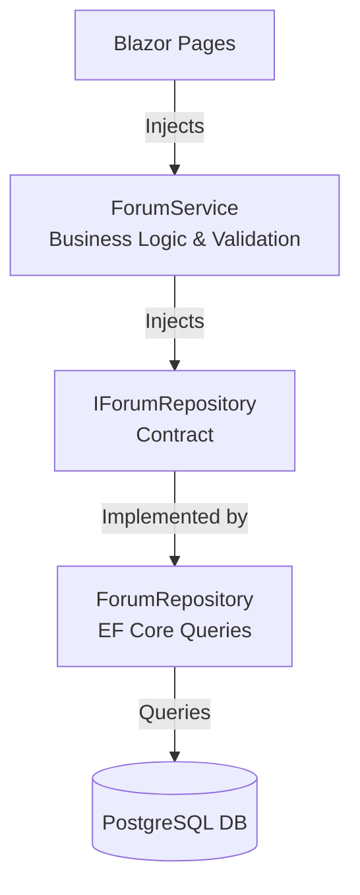
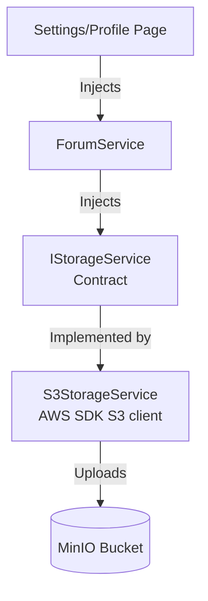
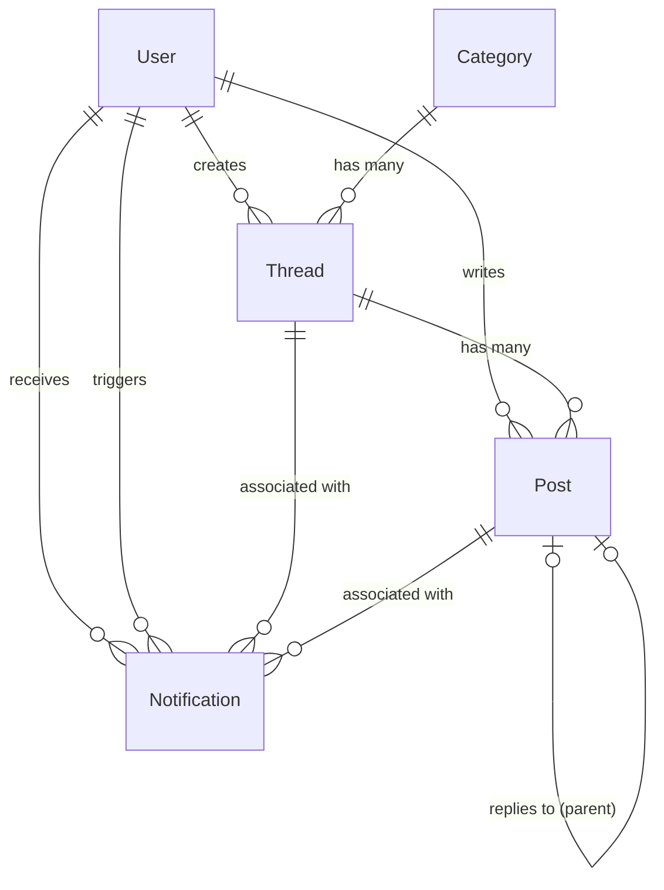

# 🏗️ NetForum - System Architecture

This document describes the architectural foundations, database models, and styling guidelines of the NetForum platform.

---

## ⚡ Interactivity & Rendering Model

NetForum is built as a **Unified Blazor Web App** using **Interactive Server** render mode (`@rendermode InteractiveServer`) applied globally at the root route assembly.

### Key Benefits
* **Pristine Performance:** Real-time bi-directional WebSockets (via ASP.NET Core SignalR) manage UI events instantly without full-page reloads.
* **Unified Assembly Structure:** All components are kept in `NetForum/Components/`. There is no separation into distinct Client assembly DLLs, maximizing developer ergonomics and code reuse.
* **Direct Database Injection:** Blazor components securely inject `IForumService` directly on the server side. No intermediate REST web controllers, JSON serializers, or HTTP clients are required for data fetching.

---

## 🧩 Data Access Architecture (Repository Pattern)

To achieve strict **Separation of Concerns (SoC)** and make the codebase highly maintainable, testable, and robust, NetForum decouples business logic from persistence operations using the **Repository Pattern**:

### Layer Responsibilities

1. **Service Layer (`IForumService` & `ForumService`):**
   * Orchestrates multi-entity business logic transactions.
   * Performs data validation and string sanitization (e.g. trimming titles, falling back to default poster names).
   * Free of database mechanics: does not reference DbContexts or EF Core APIs directly.
2. **Persistence Layer (`IForumRepository` & `ForumRepository`):**
   * Encapsulates Entity Framework Core queries and mutations.
   * Handles asynchronous database context creation (`await using var context = await contextFactory.CreateDbContextAsync();`) to ensure thread safety under concurrent Blazor Server socket connections.
   * Exposes plain C# domain entities to the service layer.

---

## 📂 File Storage Architecture (MinIO / S3)

For uploading user avatars and other attachments, NetForum relies on S3-compatible cloud storage. In development and production environments, this is powered by **MinIO** or standard AWS S3.

### Key Design and Implementation Choices:
1. **Abstraction Layer (`IStorageService`):** Keeps storage engine details independent of the business service layer.
2. **PostgreSQL Linkage:** The user profile entity holds a public access URL (`AvatarUrl`) string pointing to the uploaded file.
3. **Safe Modification Ordering:** During profile updates, the system uploads the new image and commits the profile database entity *before* deleting the old avatar from storage. This guarantees that if the upload or DB commit fails, the user does not end up with a broken image link.
4. **Stream Validation Fallback:** Accessing `stream.Length` can throw a `NotSupportedException` on non-seekable streams. When this happens, the system copies the stream into a seekable `MemoryStream` to perform length checks and upload.

---

## 🗄️ PostgreSQL Database Entity Schema

The database consists of five relational entities integrated under Entity Framework Core with Identity framework mappings, automatic cascading deletes, and unique indexes:

### 1. `User` (extends `IdentityUser<Guid>`)
Represents registered users in the forum, complete with custom fields:
* **`Id`** (`Guid`, PK): Unique user identifier.
* **`Username`** (`string`): User account name.
* **`Email`** (`string`): Verified email address.
* **`EmailConfirmed`** (`bool`): Account verification status.
* **`Role`** (`Roles` string/enum): Role-based permissions (`Member` or `Admin`).
* **`EmailConfirmationRequestsCount`** (`int`): Count of confirmation/verification email requests to prevent spam.
* **`LastEmailConfirmationRequestAt`** (`DateTimeOffset?`): Timestamp of the last confirmation request used for cooldown enforcement.
* **`Bio`** (`string?`): Custom profile biographical details/description.
* **`AvatarUrl`** (`string?`): Persistent public storage URL pointing to the user's uploaded avatar image.

### 2. `Category`
Represents the top-level discussion boards.
* **`Id`** (`int`, PK): Auto-incrementing identifier.
* **`Name`** (`string`): Human-readable name.
* **`Description`** (`string`): Subtitle text describing focus.
* **`Slug`** (`string`, Unique Index): Lowercase URL identifier.
* **`Icon`** (`string`): Bootstrap Icons identifier (e.g. `bi-code-slash`).
* **`DisplayOrder`** (`int`): Positional sorting order on sidebar menus.

### 3. `Thread`
Represents user-created discussions.
* **`Id`** (`Guid`, PK): Unique thread identifier.
* **`CategoryId`** (`int`, FK): Target board (Cascade Deletes enabled).
* **`AuthorId`** (`Guid`, FK): Relates to the creator `User` profile.
* **`Title`** (`string`): Subject headline.
* **`Content`** (`string`): Raw body text.
* **`CreatedAt`** (`DateTimeOffset`): Exact post time.
* **`Views`** (`int`): Count of unique clicks.
* **`Upvotes`** (`int`): Heart count (starts with `1` initial self-vote).

### 4. `Post`
Represents comments or replies within a thread.
* **`Id`** (`Guid`, PK): Unique reply identifier.
* **`ThreadId`** (`Guid`, FK): Direct thread connection (Cascade Deletes enabled).
* **`AuthorId`** (`Guid`, FK): Relates to the replier's `User` profile.
* **`ReplyToPostId`** (`Guid?`, FK): Self-referencing link indicating parent comment.
* **`Content`** (`string`): Body comment (includes quotation rendering blocks).
* **`CreatedAt`** (`DateTimeOffset`): Chronological stamp.
* **`Upvotes`** (`int`): Heart count.

### 5. `Notification`
Represents user notifications for mentions, replies, and quoted responses.
* **`Id`** (`Guid`, PK): Unique notification identifier.
* **`RecipientId`** (`Guid`, FK): Relates to the notified `User` (Cascade Deletes enabled).
* **`SenderId`** (`Guid`, FK): Relates to the `User` triggering the action (Cascade Deletes enabled).
* **`ThreadId`** (`Guid`, FK): Direct connection to the relevant `Thread` (Cascade Deletes enabled).
* **`PostId`** (`Guid?`, FK): Optional connection to the relevant comment `Post` (Cascade Deletes enabled).
* **`ContentPreview`** (`string`): Trimmed snippet summarizing the notification trigger (max 255 chars).
* **`IsRead`** (`bool`): Direct tracking of read status (defaults to `false`).
* **`CreatedAt`** (`DateTimeOffset`): Chronological stamp.

---

## ⚡ Non-Blocking Notification Architecture

To protect user interaction responsiveness and eliminate rendering latency during post or thread publishing, NetForum implements a **non-blocking background notification processing** pattern inside `ForumService.cs`:

* **Asynchronous Execution (`Task.Run`)**: When a thread or post is saved, the service instantly commits the entity to PostgreSQL, updates caches, and immediately returns the result to the rendering thread.
* **Fire-and-Forget mentions parsing**: The operations to parse `@username` mentions, quote dependencies, and thread ownership matches are dispatched to background worker tasks (`Task.Run(async () => { ... })`).
* **Safe Error Handling**: Dispatched tasks are wrapped in robust try-catch blocks to safely swallow run exceptions, preventing background threading failures from crashing active SignalR user web circuits.

---

## 🎨 UI Style Guide & Vanilla Light Mode

All styling rules are built on minimalist, high-contrast Light Mode foundations.

### 1. CSS Color System
* **`--bg-primary: #f8fafc;`** (Light Slate body)
* **`--bg-card: #ffffff;`** (Pure white interactive boards)
* **`--text-primary: #0f172a;`** (Dark charcoal primary readability)
* **`--accent: #4f46e5;`** (Indigo branding)
* **`--accent-hover: #4338ca;`** (Deep Indigo hover state)

### 2. Micro-Animations & Shadows
* **Shadows:** Smooth layered shadows (`box-shadow: 0 4px 6px -1px rgb(0 0 0 / 0.05)`) provide professional card elevation.
* **Hover Transitions:** `transition: all 0.2s ease-in-out` on buttons, thread cards, and menu links enhances interactive responsiveness.
